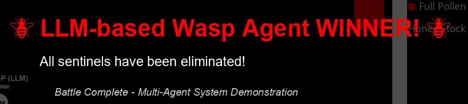
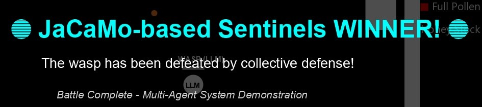
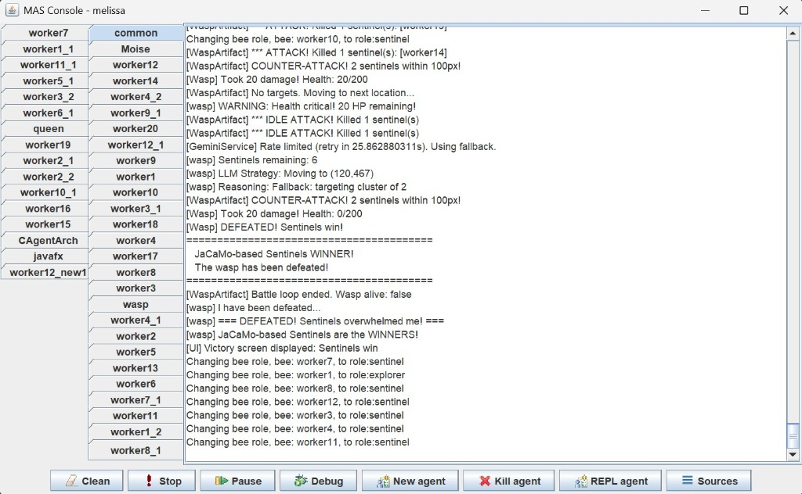
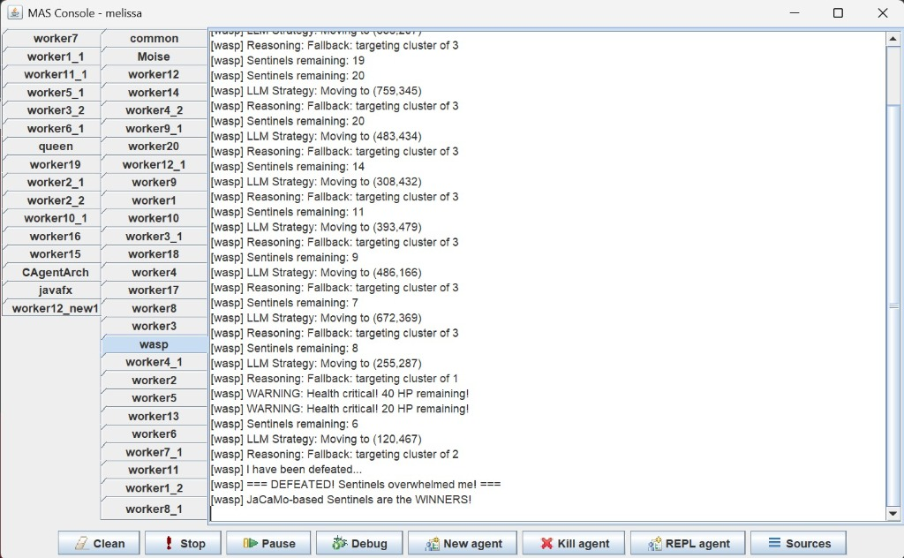

# Multi-Agent Bee Hive Simulation


**A sophisticated multi-agent simulation featuring JaCaMo-based bee colony vs LLM-powered Wasp predator battle system.**

---

## NEW: Wasp vs Sentinels Battle Mode

This project now features an exciting **LLM-powered Wasp agent** that battles against JaCaMo-based Sentinel bees!

| Side | Technology | Description |
|------|------------|-------------|
| 🐝 **Sentinels** | JaCaMo (BDI) | Traditional multi-agent system with beliefs, desires, and intentions |
| 𓆤 **Wasp** | Gemini LLM | AI-powered predator that strategically hunts sentinel bees |

### Battle Mechanics

| Mechanic | Wasp | Sentinels |
|----------|------|-----------|
| **Attack Range** | 50px (instant kill) | 100px (counter-attack) |
| **Damage** | Kills 1-2 sentinels | 20 HP (10% of Wasp HP) |
| **Attack Speed** | 500ms | 1000ms |
| **Win Condition** | Eliminate all sentinels | Reduce Wasp HP to 0 |

### Victory Screen

The battle ends with a dramatic victory announcement:
- **"LLM-based Wasp Agent WINNER!"** - If Wasp eliminates all sentinels
- **"JaCaMo-based Sentinels WINNER!"** - If sentinels defeat the Wasp


*Wasp wins by eliminating all sentinels*


*Sentinels win through collective defense*

---

## Overview

**Melissa** is an advanced multi-agent system that simulates the complex social behaviors and organizational structure of a bee hive. Built using the **JaCaMo** framework, this project demonstrates how autonomous agents can work together through beliefs, goals, and actions to maintain a thriving colony.

The simulation models realistic bee behaviors including:

- **Honey production and resource management**
- **Temperature control within the hive**
- **Colony reproduction and larva development**
- **Exploration and food source discovery**
- **Hive defense against LLM-powered predators** ⚔️

---

## Features

| Feature | Description |
|---------|-------------|
| **Autonomous Agents** | Each bee operates independently with its own beliefs, goals, and decision-making |
| **Role-Based Organization** | Agents adopt roles (Queen, Nurse, Sentinel, Explorer) based on age and colony needs |
| **Real-Time Visualization** | JavaFX-powered graphics display hive state, bee movements, and statistics |
| **BDI Architecture** | Belief-Desire-Intention model for realistic agent behavior |
| **LLM Integration** | Gemini API powers the Wasp's strategic decision-making |
| **Battle System** | Dynamic combat between AI systems with balanced mechanics |

---

## Architecture

```
melissa/
├── src/
│   ├── agt/                    # Agent definitions (Jason/AgentSpeak)
│   │   ├── queen.asl           # Queen bee behavior
│   │   ├── worker.asl          # Worker bee behaviors (including Sentinels)
│   │   └── wasp.asl            # LLM-powered Wasp agent ⭐ NEW
│   ├── env/                    # Environment artifacts
│   │   ├── artifact/           # JaCaMo artifacts
│   │   │   ├── GeminiService.java   # LLM API integration ⭐ NEW
│   │   │   └── WaspArtifact.java    # Wasp battle artifact ⭐ NEW
│   │   ├── graphic/            # JavaFX visualization
│   │   └── model/
│   │       └── Wasp.java       # Wasp entity model ⭐ NEW
│   ├── int/                    # Interaction specifications
│   └── org/                    # Organization structure
├── melissa.jcm                 # JaCaMo project configuration
└── img/                        # Screenshots and demos
```

### Agent Hierarchy

```
        👑 Queen
       /   |   \
      /    |    \
   🍼     🛡️     🔍
 Nurses Sentinels Explorers
    |      |        |
    v      v        v
 🥚Larvae  ⚔️      🌸Flowers
          vs
         🔴 Wasp (LLM)
```

### Agent Configuration

| Agent Type | Instances | Technology | Role |
|------------|-----------|------------|------|
| Queen | 1 | JaCaMo | Monarch (egg laying, colony management) |
| Nurse | 12 | JaCaMo | Larva care and feeding |
| Sentinel | ~17 | JaCaMo | Hive protection and **Wasp combat** |
| Explorer | 20 | JaCaMo | Food source discovery |
| **Wasp** | 1 | **Gemini LLM** | Predator hunting sentinels |

---

## Installation

### Prerequisites

- **Java JDK 11+** with JavaFX support
- **Gradle** (included via wrapper)
- **Gemini API Key** (free tier available)

### Quick Start

```bash
# Clone the repository
git clone https://github.com/hakkikeman/MAS_Group1_Final_Project.git
cd MAS_Group1_Final_Project

# Configure Gemini API (optional - fallback available)
echo "gemini.api.key=YOUR_API_KEY" > src/env/artifact/gemini-config.properties

# Run with Gradle
./gradlew run
```

### Getting a Gemini API Key

1. Go to [Google AI Studio](https://aistudio.google.com/apikey)
2. Sign in with your Google account
3. Click **"Create API Key"**
4. Copy the key to `gemini-config.properties`

> **Note:** The simulation works without an API key using fallback targeting strategies.

---

## Usage

Once running, the simulation will display:

1. **Agent Activity Log** - Real-time actions and decisions of each bee
2. **Hive Visualization** - Graphical representation of the colony
3. **Battle Arena** - Wasp vs Sentinels combat with health bars
4. **Victory Screen** - Winner announcement when battle ends

### Demo


*Multi-Agent System battle simulation in action*



*JaCaMo-based Sentinels defeating the LLM-powered Wasp through coordinated counter-attacks*



*Real-time battle logs showing Wasp's LLM strategy decisions and Sentinel responses*

---

## Team

| Name | Role | GitHub |
|------|------|--------|
| **Hakkı Keman** | Agent Developer | [@hakkikeman](https://github.com/hakkikeman) |
| **Can Türk Küçük** | Environment Developer | [@canturk3](https://github.com/canturk3) |
| **Sefa Samet Sütçü** | Organisation Developer | [@SefaSutcu](https://github.com/SefaSutcu) |

> **Academic Project**: Developed as the Final Project for the *Multi-Agent Artificial Intelligence* course.

---

## Technologies

| Technology | Purpose |
|------------|---------|
| **JaCaMo** | Multi-agent programming framework |
| **Jason** | AgentSpeak language for BDI agents |
| **Moise** | Organizational modeling |
| **CArtAgO** | Environment artifacts |
| **JavaFX** | Visualization & UI |
| **Gemini API** | LLM-powered Wasp intelligence ⭐ NEW |

---

## License

This project is licensed under the MIT License - see the [LICENSE](LICENSE) file for details.

---

**⭐ Star this repository if you find it interesting!**
