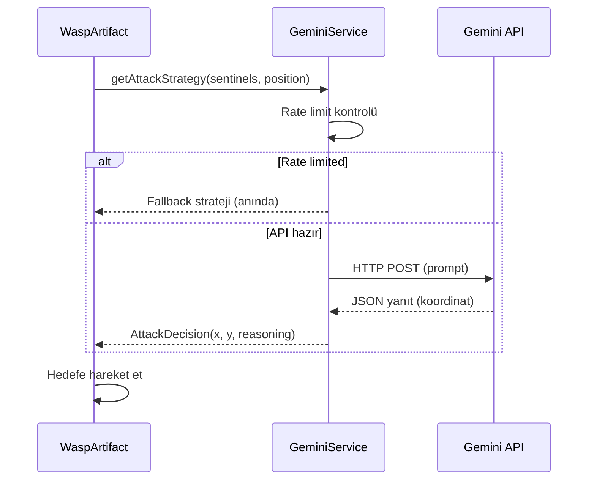

# Environment Katmanı - LLM Entegrasyonu ve Optimizasyonlar

## Genel Bakış

Bu rapor, projeye eklenen LLM (Large Language Model) entegrasyonunu ve Wasp hareket algoritmasının optimizasyonunu açıklamaktadır.

---

## Bölüm 1: LLM Entegrasyonu

### LLM'in Projeye Katkısı

LLM, **Wasp ajanına stratejik zeka** kazandırır. Wasp, sentinel arılarını avlarken izole hedefleri belirlemek için Gemini LLM'den yardım alır.

| Özellik | Geleneksel Yaklaşım | LLM ile |
|---------|---------------------|---------|
| Hedef Seçimi | Rastgele veya en yakın | Stratejik (izole, güvenli) |
| Tehdit Değerlendirmesi | Sabit kurallar | Dinamik analiz |
| Adaptasyon | Yok | Duruma göre strateji |

### LLM'in Çalıştığı Dosyalar

```
src/env/artifact/
├── GeminiService.java    ← LLM API iletişimi
├── WaspArtifact.java     ← LLM'i kullanan savaş döngüsü
└── gemini-config.properties ← API anahtarı
```

---

## Bölüm 2: LLM İşleyiş Akışı

### Adım Adım Süreç



### Detaylı Akış

1. **Sentinel Tarama:** `Environment.getSentinelPositions()` çağrılır
2. **LLM Sorgusu:** `GeminiService.getAttackStrategy()` çağrılır
3. **Prompt Oluşturma:** Sentinel pozisyonları ve kurallar prompt'a eklenir
4. **API Çağrısı:** Gemini API'ye HTTP POST gönderilir
5. **Yanıt Ayrıştırma:** TARGET_X, TARGET_Y, REASONING parse edilir
6. **Hareket:** Wasp belirlenen koordinata doğru hareket eder

---

## Bölüm 3: LLM Girdisi ve Çıktısı

### Örnek Girdi (Prompt)

```
You are an AI controlling a wasp predator in a beehive simulation game.
Your goal is to hunt sentinel bees efficiently.

GAME RULES:
- ATTACK: You can kill 1 or 2 sentinels if they are within 50px of you
- DANGER: If 2+ sentinels are within 100px, they will counter-attack and damage you
- STRATEGY: Target isolated sentinels (exactly 1 alone), avoid groups of 2+
- Map size: 800x600
- Hive location is at bottom-right area (around 649-799x, 449-599y) - avoid entering!

CURRENT STATE:
- Your position: (150, 200)
- Sentinel positions:
  Sentinel 1: (300, 150)
  Sentinel 2: (305, 155)
  Sentinel 3: (500, 400)
  Sentinel 4: (120, 450)

ANALYZE and choose the BEST attack position that:
1. Has exactly 1 sentinel within 50px (safe kill)
2. Has fewer than 2 sentinels within 100px (avoid counter-attack)
3. Targets sentinels OUTSIDE the hive (they cannot retreat)

RESPOND IN THIS EXACT FORMAT:
TARGET_X: <number>
TARGET_Y: <number>
REASONING: <brief explanation in one line>
```

### Örnek Çıktı (LLM Yanıtı)

```
TARGET_X: 120
TARGET_Y: 450
REASONING: Sentinel 4 is isolated at (120, 450), far from other sentinels, safe to attack without counter-attack risk.
```

---

## Bölüm 4: Hareket Algoritması Optimizasyonu

### Orijinal Problem

```
[Hedefe var] → [2 saniye bekle] → [LLM sorgu] → [Yanıt bekle] → [Hareket]
                     ↑
            Saldırıya açık süre
```

### Optimizasyon 1: Async Prefetch

Hareket sırasında sonraki hedefi önceden sorgula:

```java
// GeminiService.java - Yeni metodlar
public void prefetchNextStrategy(...)  // Arka planda LLM sorgusu
public boolean hasPrefetchedDecision() // Prefetch hazır mı?
public AttackDecision getPrefetchedDecision() // Sonucu al
```

### Optimizasyon 2: Minimal Bekleme

```java
// WaspArtifact.java - Bekleme süresi
int maxWaitSteps = 1; // 50ms (eskisi: 40 = 2000ms)
```

### Sonuç

| Metrik | Eski | Yeni |
|--------|------|------|
| Hedefler arası bekleme | 2000ms | 50ms |
| Tutarlılık | Değişken | Sabit |
| Saldırıya açıklık | Yüksek | Düşük |

---

## Bölüm 5: Savaş Kuralları Özeti

### Wasp Saldırı Kuralları

| Yarıçap | Sentinel Sayısı | Wasp Davranışı |
|---------|-----------------|----------------|
| 0-50px | 1 | ✅ Güvenli saldırı |
| 0-50px | 2 | ⚠️ Saldırı + risk |
| 0-100px | 2+ | ❌ Counter-attack alır |

### Counter-Attack Mekanizması

```java
// 2+ sentinel 100px içinde → 20 hasar
if (allWithin100px >= 2) {
    wasp.takeDamageAmount(20); // %10 hasar
}
```

---

## Bölüm 6: LLM Entegrasyon Diyagramı

```
┌─────────────────────────────────────────────────────────────────┐
│                        WASP BATTLE LOOP                         │
├─────────────────────────────────────────────────────────────────┤
│                                                                 │
│  ┌──────────────┐    ┌─────────────────┐    ┌───────────────┐  │
│  │   Sentinel   │───▶│  GeminiService  │───▶│  Gemini API   │  │
│  │  Positions   │    │                 │    │  (Cloud LLM)  │  │
│  └──────────────┘    └────────┬────────┘    └───────────────┘  │
│                               │                                 │
│                               ▼                                 │
│                      ┌────────────────┐                        │
│                      │ AttackDecision │                        │
│                      │  - targetX     │                        │
│                      │  - targetY     │                        │
│                      │  - reasoning   │                        │
│                      └───────┬────────┘                        │
│                              │                                  │
│                              ▼                                  │
│  ┌──────────────┐    ┌─────────────────┐    ┌───────────────┐  │
│  │    Wasp      │◀───│   Move Toward   │◀───│   Execute     │  │
│  │   Entity     │    │     Target      │    │    Attack     │  │
│  └──────────────┘    └─────────────────┘    └───────────────┘  │
│                                                                 │
└─────────────────────────────────────────────────────────────────┘
```

---

## Özet

1. **LLM Entegrasyonu:** Gemini API ile stratejik hedef seçimi
2. **Async Prefetch:** Hareket sırasında sonraki hedefi önceden sorgulama
3. **Minimal Bekleme:** 2s → 50ms (tutarlı hızlı hareket)
4. **Savaş Dengesi:** 2+ sentinel = counter-attack (100px yarıçap)

---

*Hakkı & Can Türk - Çok Etmenli Yapay Zeka Final Projesi*
